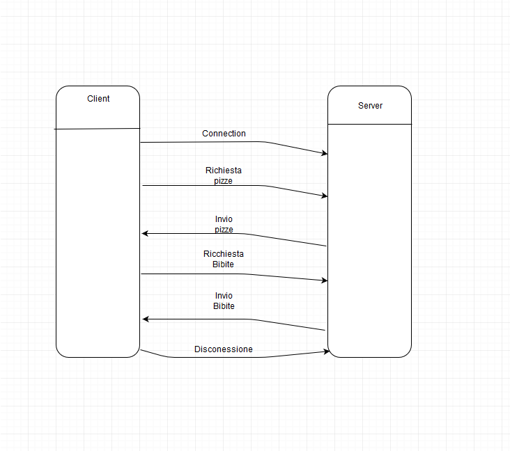
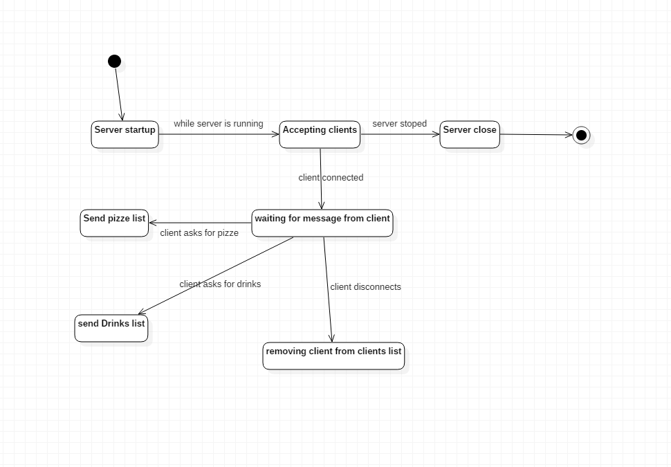
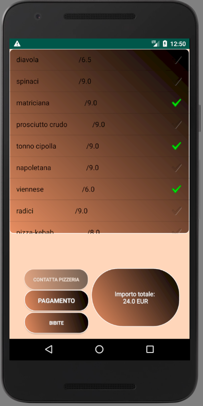
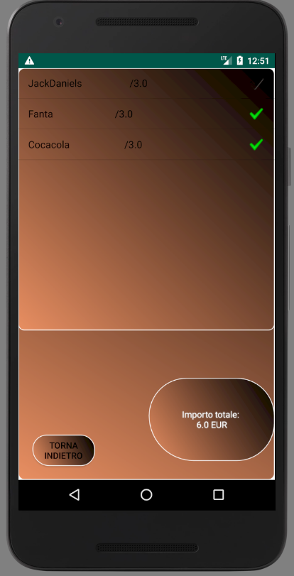

# PizzeriaGennarino

Il progetto consiste in un server Java rappresentante una pizzeria che implementa un sistema di ordinazioni via Internet facendo uso di un'applicazione Android.

## Server
Nella directory `ServerExecutor` vi è l'implementazione del  server in java, il quale fa uso del `CachedThreadPool` in modo da poter gestire più clienti alla volta evitando di mettere i task in coda. Quando tutti i thread utilizzati sono impegnati, ne crea altri per eseguire il task, evitando così di far aspettare i client.

Il server viene fatto partire in un thread che continua a stare in ascolto per ricevere i nuovi client, usando l'executor per gestirne gli ordini appena un client è pronto ad inviare, effettuando il controllo del bufferedReader del client tramite lo stato "ready()". Una volta che un client connesso è pronto a comunicare, il server crea quindi il task che dara in pasto all'executor, il quale si occuperà di far partire il protocollo di comunicazione tra i due.

Il client comunica con il server grazie a un protocollo "testuale", gestito dal server nella classe `Pizzeria`, una volta che il client si è connesso, in base alla stringa che il server manda, risponde in modo diverso. Inizialmente il client invia una stringa ack al server, il quale capisce che è ora di inviare la lista delle pizze al client, tale lista viene gestita dalla classe `Pizze`, che incapsula le pizze in un hashmap. Una volta mandate le pizze al client con il rispettivo prezzo, il client è in grado di selezionarle e prosseguire allo scontrino, oppure scegliere di comprare anche delle bibite, altro comando che fa si che il server mandi la propria lista di bibite con i rispettivi prezzi. 

Il diagramma sottostante indica invece gli stati che attraversa il server mano a mano che il cliente procede all'ordine.

## Client

Il client android ha il compito di interfacciare l'utente con la lista delle pizze e delle bibite inviate dal server. Il client si occupa del invio dei comandi al server, reagendo in base alle sue risposte, e calcolando inoltre l'importo totale in base alle pizze e bibite scelte.

Una volta effettuata la connessione, il server risponde inviando la lista delle pizze ordinabili ed i loro prezzi, popolando di conseguenza l'interfaccia grafica che permette la creazione dell'ordine.

---

## Images

